# DbStudy
---
# 声明
本项目是由servlet、jsp等技术实现的，主要用于对基础知识的学习与巩固，在功能或业务的实现上尽量避免使用其他完善框架，仅用于学习，无实际商业价值。

- Tomact：8.5.37
- MySql：5.6.24
# 系统详细设计
本项目总共有三个模块，分别为学生模块，教师模块，管理员模块，这三大模块又分为若干小模块，下面是各模块的实现思路进行分析，并展示实现后的效果。
## 学生模块

### 登录功能
在未登录时进入主界面，可以看到登录的按钮，使用其他功能会有尚未登录的提醒，点击登录按钮进入登录界面，输入用户名，密码和验证码，会在后台调用MySql数据库，查询用户名与密码是否存在，若存在登录成功，若不存在返回错误信息到前端，显示用户不存在，若登陆成功，检测是否勾选记住密码选项，若勾选记住密码，则将用户名与密码存入浏览器的Cookie中，生命周期为一周。之后自动跳转至首页面，界面发生改变，同时登录与注册选项消失，被首页的功能取代，下方为登陆功能
```
if(!verifyCode.equalsIgnoreCase((String)(session.getAttribute 		("verifyCodeForLogin")))) {
     req.setAttribute ("verif_error", "验证码错误"); //将错误信息存储入request域中
     return "f:/main_jsp/login.jsp"; //验证失败后返回登录界面
 }
 try {
     user_success = us.findUser (user);//通过数据库查询查找用户
 } catch (NotFindUserException e) { //如果没有这个用户就报未找到用户异常
     req.setAttribute ("login_error", e.getMessage ()); //错误信息存入request域中
     return "f:/main_jsp/login.jsp";  //未找到用户返回登陆界面
 }
 getCookieCheck (req, resp, user); //判断用户是否勾选记住密码
 session.setAttribute ("user", user_success); //登陆成功把用户信息存储入session域中
```
<div align="center">
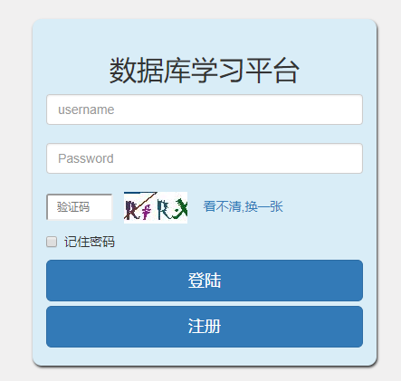
<p>登陆界面</p>
</div>

### 注册功能
在未登录时，可以在主界面上看到注册的选项，也可以在登录界面选择注册的功能，点击即可进入注册界面，在注册界面会显示要求注册的信息，与验证码验证，注册界面前端使用正则表达式来验证用户输入的信息是否合法，若不合法则给予提示，同时在用户名栏处提供检测重复用户名的功能，点击检测重复按钮，利用ajax技术对界面进行局部刷新，调用后台在数据库中查找重复用户名，若无重复显示打√否则×。点击注册按钮，传递用户输入的数据至后台，检索是否重复，并返回结果，注册成功跳转至注册成功界面，并在5秒后自动跳转至主界面，若失败提示相应的错误信息。
```
User user = BeanUtils.toBean (req.getParameterMap (), User.class);//从前端取出信息
if (!verifyCode.equalsIgnoreCase (vf)) {//判断验证码是否匹配
    req.setAttribute ("verif_error", "验证码错误");
    req.setAttribute ("user",user);//就算失败也要将错误的信息再次显示在前端
    return "f:/main_jsp/regist.jsp";//返回注册界面
 }
 getHideMsg (req, user);//将一些隐藏的数据加入用户信息中，例如：初始化头像等
 try {
    us.insertUser (user);//把封装好的用户数据存入数据库
 } catch (PleaseInputTureMessageException e) {//存入输入失败或不匹配
    req.setAttribute ("user"，user);
    req.setAttribute ("regist_error",e.getMessage ()); 
    return "f:/main_jsp/regist.jsp";
 }
//用户注册成功，通过response给响应头添加5秒跳转至主界面参数
 resp.setHeader("refresh","5;url="+req.getContextPath () + "/main_jsp/index.jsp";
return "f:/main_jsp/regist_success.jsp";//跳转至成功界面
```
<div align="center">
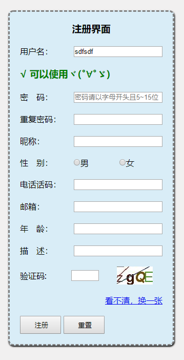
<p>注册界面</p>
</div>

### 验证码功能
利用java中的Graphics2D对象绘制验证码，并且将生成的验证码以字节流传递至前端界面，并显示，同时返回验证码上的字符至后台，当用户提交后将用户输入的数据与后台数据进行比较，不区分大小写相同验证通过，不相同显示验证码错误。
```
public BufferedImage getImage(int num) {
    BufferedImage image = createImage(); //通过G2D绘制一张有背景色的图像
    Graphics2D g2 = (Graphics2D) image.getGraphics();//获取G2D画笔
    StringBuffer sb = new StringBuffer();
    groupImg (g2, sb);//将绘制的字符与背景色组合
    text = sb.toString();//记录图片中的文字
    drawLine(image, num);//给合成后的图片绘制干扰线，num决定了干扰线的条数
    return image;//将图片返回
 }
```
### 个人主页
当用户登录成功后才会在前端显示的功能，用户可以通过该功能实现查看并修改自己的信息，同时还可以查看自己在本站的错题本，在修改信息时利用正则进行检测，不合格进行提示，点击修改，传递至后台检索并返回提示。同时用户还可以更换自己的头像，可以为默认头像或用户自己上传的头像，点击上传头像间数据上传至客户端，在客户端对上传文件进行验证，例如：文件大小，文件后缀等信息进行审核，审核通过将头像数据通过io流输出至本地服务器，并将文件路径存入总图库，并将对应的图片id与对应的用户id关联，即多对一的关系，一个用户只能有一个头像，但是一个头像可以被多个用户使用。
```
    try {
        getPartAndNameAndType (req); //通过request获取用户上传的头像数据
        if (!verifyFile (req, resp, path, p, fileType)) return;//验证文件是否可用
    } catch (IOException |ServletException e) {
        e.printStackTrace ();
        getHeadImg (req, resp);//失败调用所有默认的文件返回前台
	//若不调用失败后无法再前台看到默认头像
        return;
    }
//文件名为用户id加当前时间的毫秒值加当前文件的类型
    fileName = user.getUid () + "_" + System.currentTimeMillis () + fileType;
    filePath = (path + "\\" + fileName).replaceAll ("\\\\", "/");
    deleteExistFile (path, user);//把现存的非默认头像删除
    try {
        p.write (filePath);//将文件输出至服务器端
    } catch (IOException e) {
        e.printStackTrace ();
        getHeadImg (req, resp); return;
    }//上传成功后更新图库表和用户与图库的关联表
updateUserHeadByImgStoreAndUserImgStore (req, resp, user);
```
以上源码是上传图片部分的主要流程部分代码，应当注意地方有很多例如：在图片上传后如何记录并区分默认头像与用户主动上传的头像？解决的方法有很多，在本项目中使上传的文件名为用户的id号加当前的时间，来区分具体的用户头像的所属与优先级。还应当防止在上传失败是应当及时清除垃圾数据，要保证程序的原子性。
<div align="center">

<p>头像模态窗</p>
</div>

### 每日一练
本功能在主界面可以看到，未登录时也可以进入，但是会被提示目前尚未登录，但可以关闭窗口，不会强制跳转，在本界面会显示具体的题库，目前用的自动化生成的测试题库进行检测，同时还会有精华榜，可以显示当前热度前五习题的信息，点击可以展开来查看具体的信息。同时实现分页，同时可以在多种题库中自由跳转。
```
int num = Integer.parseInt (req.getParameter ("cp_stl"));//获取页数取出为字符串需要转化为整型
//如果传递的数据大于0并且小于总页数说明是当前页
if (num > 0 &&  num <=page.getTotalPage ()) {
    this.cp = num;
}
try {
    getlist (req);//获取当前页数数据
} catch (NotFoundTestException e) {
    e.printStackTrace ();
    cp = page.getTotalPage ();
}
```
以上源码为分页的核心流程部分，至此已经能够取出正确的数据返回之前端显示，在前端需要注意，因为只有登录后的用户才能够进入做题故应当通过javaScript判断并处理用户未登录便进入的情况。
```
	<c:if test="${empty user}">
   		 <script>
        			$("#myModal").modal('show')
   		 </script>
	</c:if>
```
以上为jquery与JSP标签实现的功能，如果未登录便将一开始隐藏的弹窗显示。接下来需要注意的是如果用户无视提醒直接点击进入时应当做的处理，用户在点击链接进入对应题库时，前端会发送请求返回至后台，若不做处理用户会匿名进入题库那么如何来处理呢？可以通过谷歌浏览器自带的转包工具发现当用户请求TestLibraryServlet时浏览器自动跳转至了登录界面。
实现的方式很简单，可以通过Servlet过滤器[]来实现对匿名用户的隔离，例如在过滤器中检测session中的用户名是否为空，若为空则说明是匿名用户，变转发请求至其他页面。

<div align="center">
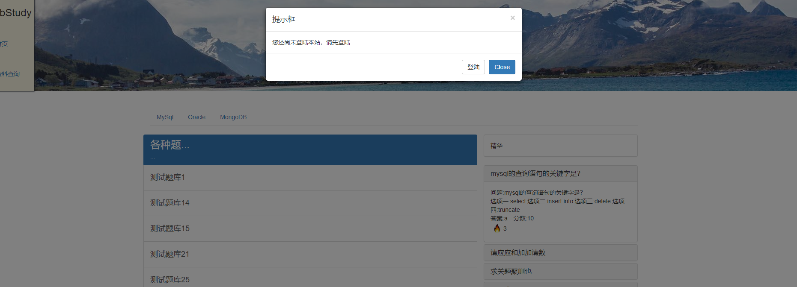
<p>题库</p>
</div>

### 习题页
在每日一练中选择任意题库，即可进入与其对应的习题页，进入时若用户未登录，会被过滤器拦截并强制跳转到登录界面，若登陆会在后台对应的题库中随机提取十道题，并显示到前端，在本界面上端会显示开始考试的提醒，用户选择选项并点击提交，在后台验卷，并返回分数，同时正确的题目会变成绿色，错误的题目会变成红色，习题的右边出现查看正确答案的按钮，点击查看弹窗显示题目详情，并提供加入错题本与关闭按钮。以下是如何判断测试题的源码：
```
int score = 0; //初始化分数为0
int i = 0;//设置标记为0，因为用户传递来的题目列表最后使用从0开始的数据标记的
for (Test st : list) { //遍历用户做完后的题目
    if (req.getParameter ("answer" + i) != null) { //如果题目不是空的，说明用户做了这道题
        if (st.getResult ().equalsIgnoreCase (req.getParameter ("answer" + i))) {//判断正确答案
            rightAnswer.add ("answer" + i + st.getResult ().toUpperCase ()); //把结果分类存储
            score += st.getScore ();//题做对了加分
        } else {
            errorAnswer.add ("answer" + i + req.getParameter ("answer" + i).toUpperCase ());
        }
    }
    i++;
}
req.setAttribute ("rightAnswer", rightAnswer); //返回正确的题目到前端，标记为红色
req.setAttribute ("errorAnswer", errorAnswer);//返回错误的题目到前端，标记为绿色
req.setAttribute ("score", score);//返回分数到前端
return "f:/main_jsp/test.jsp";
```
得到对应的分数后，点击加入错题本按钮，会利用ajax将对应题目的id传递至后台，并插入数据与对应的用户关联，实现加入错题本的功能，同时题目的热度上升一人。若再次点击加入错题本按钮会在上方弹窗提示错题已在错题本中。在界面的上端开始考试字样会变换成对应的分数值。
```
function addWrongBook(sid) {//此处的sid为对应题号的id号
    $.ajax({url: "TestServlet",type: "post", dataType: "json",
        data: { "method": "ajaxAddWrongBook", "sid": sid }，
	 success: function (result) {
            if (result) { alert("添加成功")；} else {
                alert("错题本中已有")；
            } }});
}
```
<div align="center">
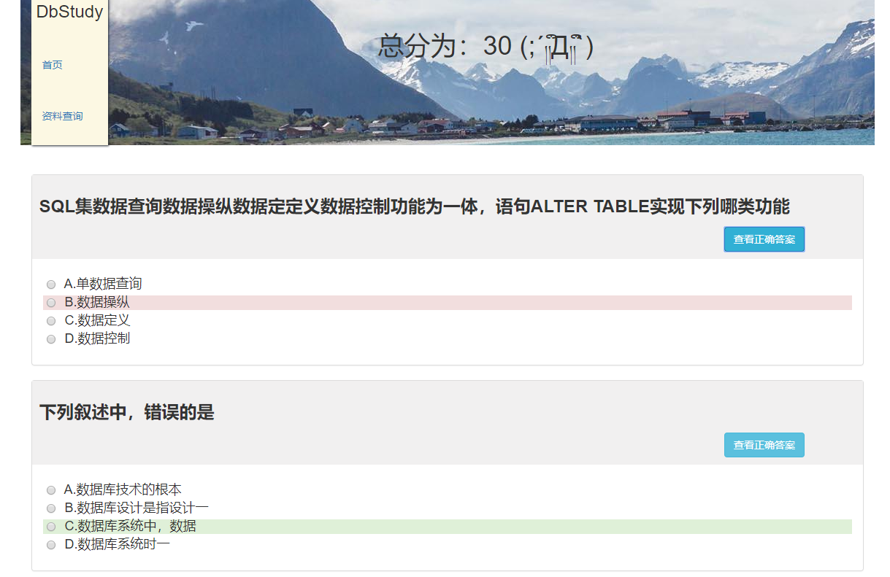
<p>判卷</p>
</div>

<div align="center">
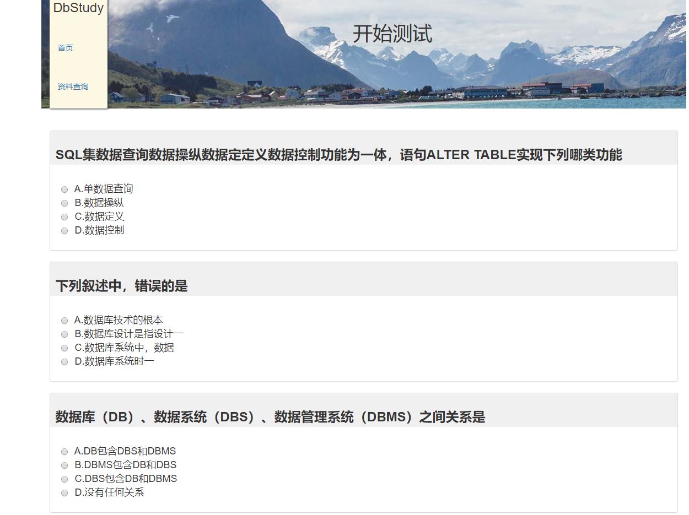
<p>做题</p>
</div>

<div align="center">
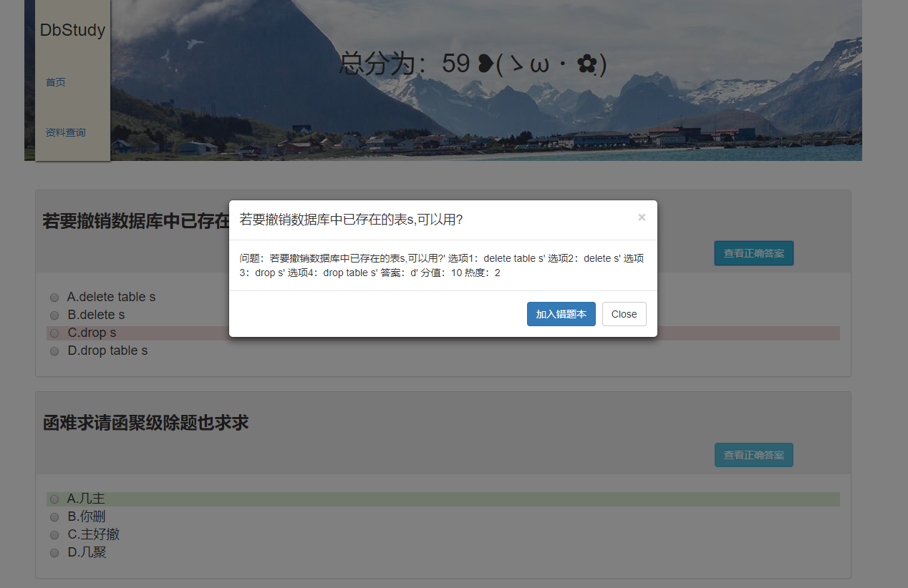
<p>查看做题详情</p>
</div>

### 错题本
在个人主页可以查看错题本，如果用户添加过错题，那么进入本页面就可以看到所有添加过的错题，并且可以在对应题目的右边看到查看详情的选项，点击即可查看详细信息，在错题本的上方可以按日期进行查询对应日期的错题，若当天没有错题则不会显示错题，否则显示相应的错题，并按照时间排序。这一部分主要是一些数据库sql的操作，通过like关键字对日期进行模糊查询，例如：”select * from wrongbook where uid = ？ and time like ‘%”+datatime+”%’”;
 如果能够查询得到数据，便将数据取出并存储到数组或链表中返回至前端。至如何于添加题目至错题本刚才上方已经给出了如何通过ajax将数据发送至前端，下面会对后台的接收与处理进行分析。
```
new WrongBookService (Drputils.getProperties () //将用户名与题目id存入错题本
        .getProperty ("WrongBook")).addWrongBookByUid (sid, uid);
ts.updateTestHotSpot (sid); //更新题目热度
resp.getWriter ().println (true); //返回前端ajax 通知弹窗
```
<div align="center">
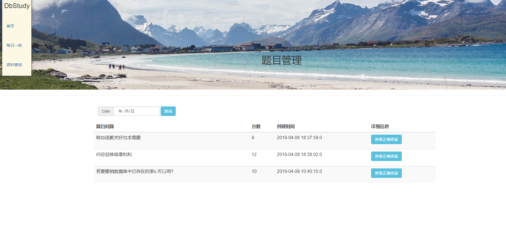
<p>错题本</p>
</div>

### 资料阅览
在首页或其他页面的标题处可以看到资料查询按钮，点击该按钮进入资料中心，其中有教师用户上传的资料，视频，文章等，学生客户可自由下载，有显示上限，显示顺序由热度决定，查看。侧边为用户排行榜根据用户上传文章热度的总数来进行排名。
<div align="center">

<p>主页</p>
</div>

<div align="center">
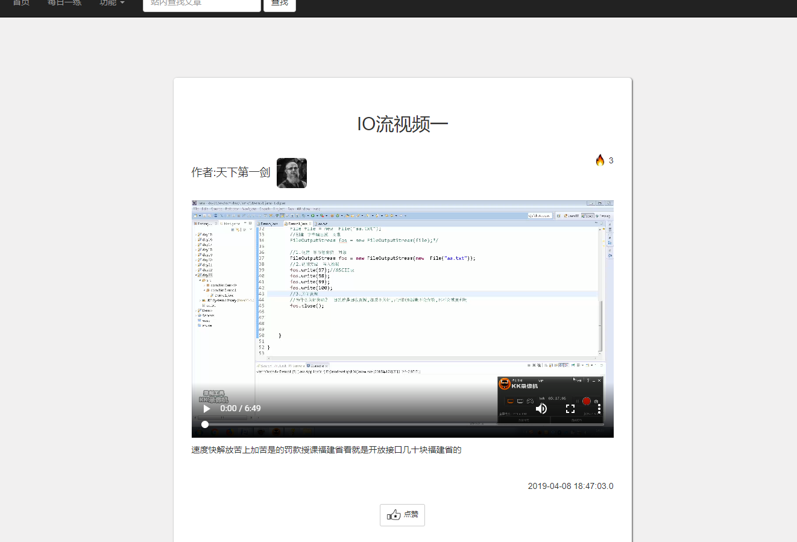
<p>视频文章</p>
</div>
经过上面的分析可以轻易的看出当前页面是如何制作的，无非也是一些简单基础的CRUD操作，首先访问此页面时通过首先调用特定的Servlet然后在数据库中取出数据至前端再用前端进行组合处理，就可以实现该效果了。本部分涉及的技术点很少，主要技术体现在前端界面，因篇幅有限，在这里就不加以深入的探讨。

### 留言询问
成功登陆的账户可以在文章板块进行留言询问，作者可以做出解答回复。未登录用户无法发布留言。在留言时将用户的id与用户的留言和文章的id存入数据库的表中，此表应为数据库的文章表与用户表的中间表，两表应为多对多地关系，即一名用户可以留言多个文章而一个文章可以被多个用户留言。本处的实现也很简单，将如果用户已经登录，将其发表的评论发布时通过CommonServlert的HttpServletRequest对象通过getParameter或getParameterMap等方法取出并封装成一个对象判断其合法性，若合法便添加至数据库。应当注意一点，但评论插入后应当返回至当前的jsp界面，但是若直接返回会无法获取其他信息，故应当转发至对应执行查询文章的Servlet下，并在转发连接后加入当前文章的参数以便查询。

<div align="center">
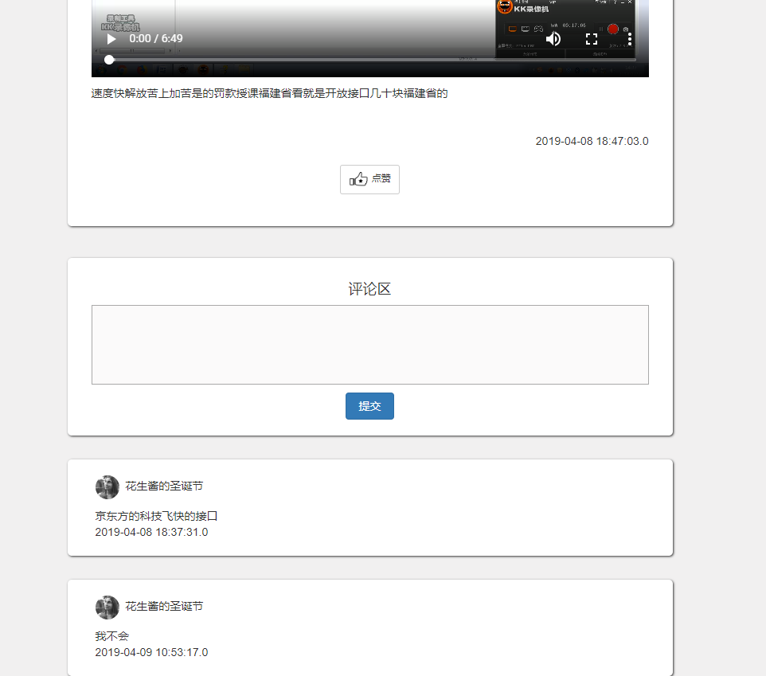
<p>留言板</p>
</div>

### 系统公告
由系统管理员发布的公告信息，用户可点击链接便可查看，不可留言。管理员发布公告至公告表，用户点击系统公告即调用发送请求AnnunciateServlet的getAnnunciatePage方法和当前页码数,调用数据库取出数据，将数据展示到前端，供用户浏览。

### 资料中心
资料中心可以查看所有文章资料，用户可以输入关键字搜索并点击链接产看具体文章内容。也可通过页码输入进入任意页面具有较好的用户体验。主体实现方法已在上方给出，此处不再加以赘述。

## 教师模块
教师模块仅限于教师账号进入并使用，在本模块中教师账户可以发表文章，发布题目，并对题目，文章等内容做修改。教师模块的实现可以通过继承学生模块的类来实现对数据库的调用，只需要重写插入用户的Dao层操作便可以轻易实现所有学生方法，所以在数据库设计时应对用户表添加属性一列，以便判断其具体定位是学生，教师还是管理员。
从上方的UML图中可以轻易的看出使用的是抽象工厂的设计模式，通过反射机制来实现类的具体实现，这样做的可以大大节省工作量，同时还能够降低类与类之间的耦合性，加强方法的复用性与独立性。在本项目中这种结构的类关系被多次使用，具体的实现位置会在下方具体实现处列出。
<div align="center">
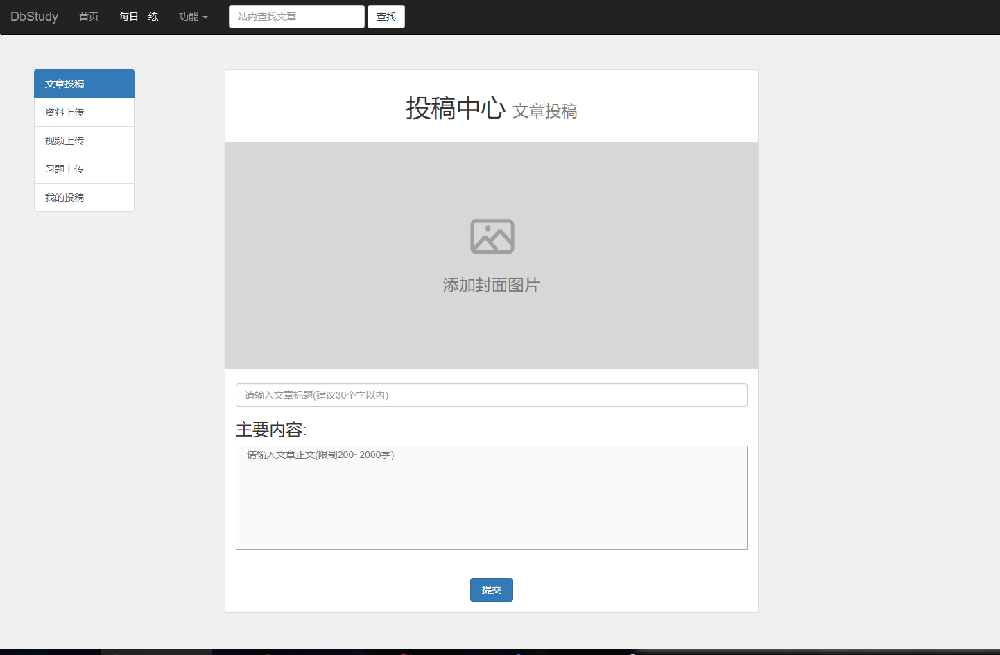
<p>投稿中心</p>
</div>
教师账户可通过点击资料中心的文章发表功能进入投稿界面，并选择希望上传的文件的类型。本模块，在设计时我对文章投稿（WriteEssayServlet）的文件大小（fileSize），文件转到的页面（filePage），文件类型（type）,文件存储路径（filePath）进行抽离，分别给予这色属性set方法以方便其他方法继承。这样只需要专注于上传文件的构建即可，具体的属性赋值可以通过读取properties文件的对应的key值决定即可。
从上图的properties文件中可以看出各个文件的允许上传的大小，格式与文件的存储路径和上传成功之后的跳转路径。然后只需要实现文件上传的功能，文件上传功能已在前面介绍过，下面会分析一下如何解析各个数据的过程。

```
public void setUpFileType() {
    this.fileType = "ImgFileType"; //通过传入需要调用key值来获取对应的文件类型
}
private String[] getUPFileType() {
    setUpFileType ();
    return Drputils.getProperties ().getProperty (fileType).split ("&");//按照&符号来切割字符串
}
//验证上传的文件是否符合规定的类型
if (!verifyImg (imgPart, fileType, Long.parseLong (Drputils.getProperties ().getProperty (fileSize)), upFileType)) {
    req.setAttribute ("img_error", "文件格式不正确");
    return false; //不符合返回false清除文件数据，并返回错误信息
}
```
上面我们实现了具有低耦合的文章发布类，接下来只需要让对应的文件上传类与视频上传类去继承并实现其对应的set方法即可，本处的三种实体类虽然从人类的感官上直接看并不是同一类别，但是从行为的角度上看却是完全相同的。

### 我的投稿
在本模块中教师账户可以查看并对删除已发布的文章，在访问该页面时，会去调用EssayServlet并返回已经上传后的文章。并将对应的文章id发送至前端与对应列关联，然后点击删除后会将想要删除的文章id发送至后台，并通过delete from essaystore where   user = ? and essayid = ? 的sql语句删除相应的关联。

## 管理员模块
管理员模块可以通过管理员账户进行登录，登录成功后可以进入管理中心，可以查看当前的网站流量，发布系统公告，文章封禁等功能。其具体实现方式已在教师模块处给出。

管理员可在此处监控网站流量的变化。本模块在前端使用了HighChart框架，该框架专用用来实现图像的可视化，而且使用起来方便快捷，而流量监控的实现方式是通过过滤器来实现的。
每当有用户访问页面都会经过该过滤器，使得application域中的count++，上面我们说过application的生命周期与服务器一样的长，那么我们可以通过对application的监控来实现对当前服务器流量的监控，我设计的监控时长为10秒，每十秒重置count计数，这一功能是由另一个流量监控的servlet来实现的。
<div align="center">
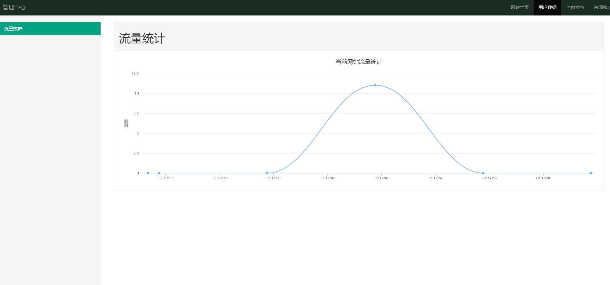
<p>管理中心流量监控</p>
</div>

### 公告发布
管理员可在此处发布系统公告，发布成功后可在公告栏处查阅，公告按照时间次序进行排序。无特殊实现方法，具体实现方法可参照文章发布模块。


### 文章管理
管理员在此对用户发布的文章信息管理或封禁。可以通过上方的搜索栏对特定文章内容或标题进行关键字搜索。本模块是上面多种模块核心部分的综合，本模块的实现类继承与文章搜索类，同时该类新增了两种ajax方法：ajaxSetEssayActive（文章状态设置），ajaxDelEssay（删除文章）。
通过这两种方法实现管理员对文章的删除与封禁。
```
public void ajaxSetEssayActive(HttpServletRequest req, HttpServletResponse resp) {
    String essayid = req.getParameter ("essayid");
    try {if (essayid.contains ("c")) {//essayid都是大写字母若其中有标记得小c说明是要封禁的
            ess.updateEssayActive (essayid.substring (1), 1);//更新数据库文章的状态为 1
        } else { 
            ess.updateEssayActive (essayid, 0);
            }//如果没有标记说明要解除封禁状态设为0
    } catch (EssayNotFoundException e) {
        try { 
            resp.getWriter ().print (false);
         }catch (IOException e1) {//返回修改失败的信号
            e1.printStackTrace ();
            }
        req.setAttribute ("error", e.getMessage ());}//失败返回错误信息
    try {
         resp.getWriter ().print (true);//返回修改成功的信号
    } catch (IOException e) { e.printStackTrace ();}
    req.setAttribute ("success", "文章已被封停");//成功返回成功信息
}
```
<div align="center">
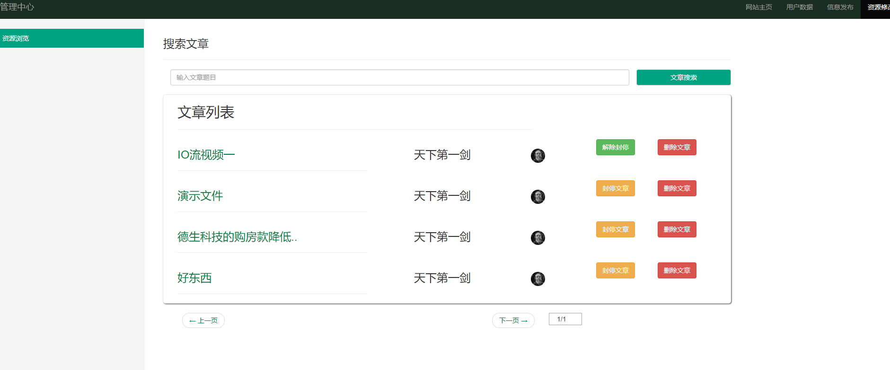
<p>文章管理</p>
</div>

<div align="center">
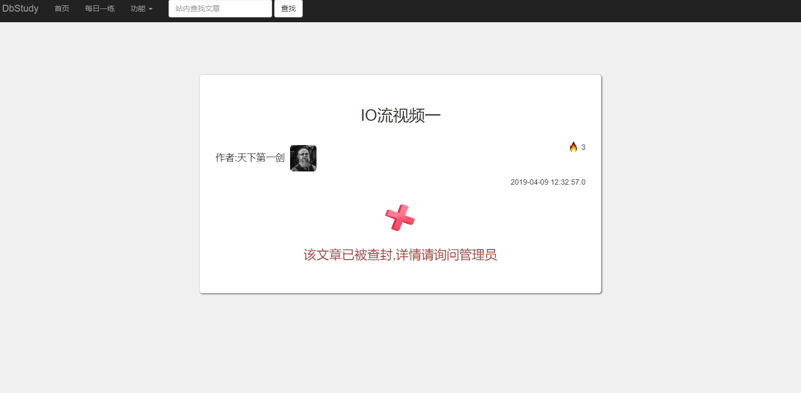
<p>被封文章</p>
</div>